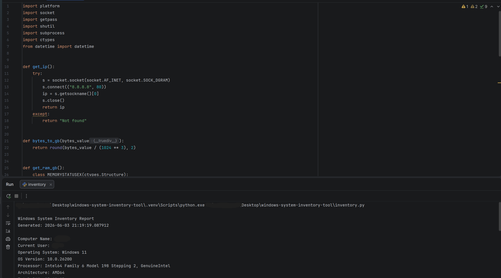

# Windows System Inventory Tool

A simple Python script that collects basic Windows system information and generates a local inventory report.

## Features

* Computer name
* Current user
* Windows version
* Processor information
* System architecture
* Total RAM
* Local IP address
* Disk C: usage
* Local user accounts

## Technologies Used

* Python
* PowerShell
* Windows 11

## How to Run

1. Install Python.
2. Download or clone this repository.
3. Run:

```bash
python inventory.py
```

4. The script will create:

```bash
inventory_report.txt
```

## Purpose

This project demonstrates basic IT support, system inventory, troubleshooting, and automation skills.

## Demo


